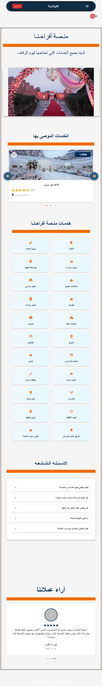
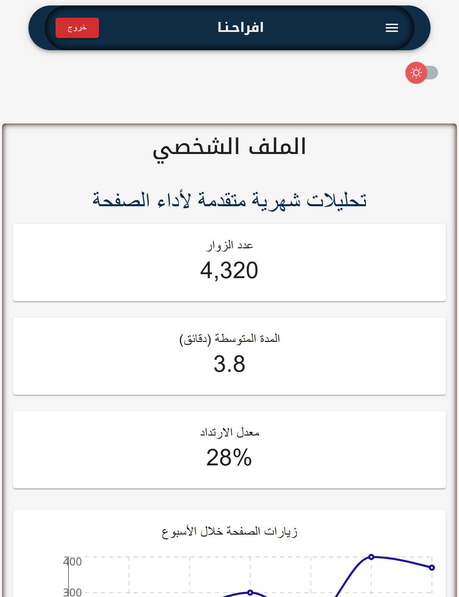
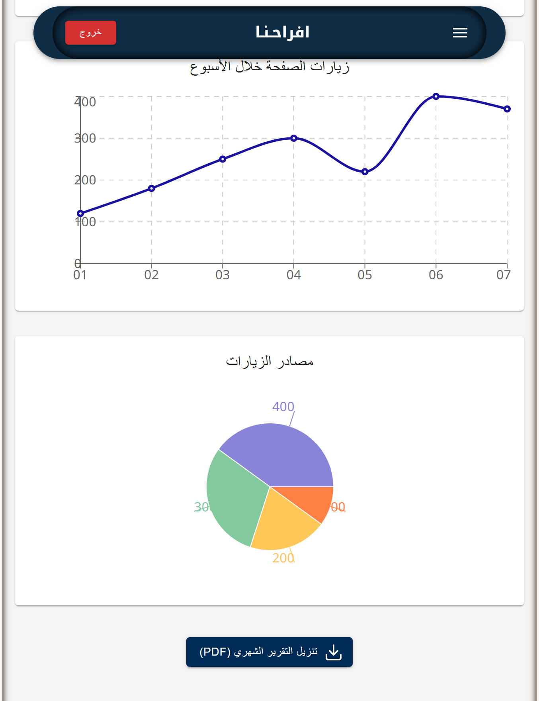

# 🌺 Afra7na - Wedding Planning Platform

## Demo

-   this may take 50 seconds or more to wake up the server because it is inactivity.

[visit Afrahna](https://client-afrahna.vercel.app/)

<div style="display: flex; flex-direction: column; align-items: center; gap: 20px; margin:100px">

</div>
<!--  -->

A comprehensive wedding planning ecosystem connecting couples with premium vendors across the Middle East. Afra7na simplifies wedding planning while empowering vendors with powerful business tools.

## Key Features

### For Couples

-   **Multi-language Support** (Arabic, Hebrew, English) - comming soon
-   **Intuitive Vendor Discovery** with rich media galleries
-   **Seamless Booking System** with calendar integration
-   **Wedding Planning Tools** (checklists, budget tracker)
-   **Secure Messaging** with vendors - comming soon

### For Vendors

-   **Advanced Analytics Dashboard**
    -   Real-time visitor metrics
    -   Engagement analytics
    -   Conversion tracking
-   **Business Management Tools**
    -   Booking calendar
    -   Portfolio management
    -   Client communication hub
-   **Professional Reports** (PDF export)

### Admin Console

-   Comprehensive user management
-   Content moderation tools
-   Platform health monitoring

## 🛠️ Technology Stack

### Frontend

| Component     | Technology                  |
| ------------- | --------------------------- |
| Framework     | React 19 + TypeScript       |
| Build Tool    | Vite                        |
| UI Libraries  | Material UI v7, Bootstrap 5 |
| Visualization | Recharts                    |
| Forms         | Formik + Yup                |
| i18n          | i18next                     |

### Backend

| Component      | Technology                |
| -------------- | ------------------------- |
| Runtime        | Node.js                   |
| Framework      | Express                   |
| Database       | MongoDB (Mongoose)- atlas |
| Authentication | JWT                       |
| PDF Generation | jsPDF                     |

## Getting Started

### Prerequisites

-   Node.js v18+
-   npm v9+
-   MongoDB (local or Atlas)

### Installation Guide

1. **Clone the repository**

```bash
git clone https://github.com/fayad123/client.git
```

2. **Set up environment variables**

````bash
# For development environment
cp client/.env client/.env

# For production environment (if you have specific production configs)
cp client/.env.production client/.env.production


3. **Install dependencies**
```bash
# Install client dependencies
npm install

````

4. **Run the development environment**

```bash
npm run dev
```

5. **Run the production environment**

```bash
npm run start
```

## 📊 Vendor Analytics Dashboard Preview

<div style="display: flex; flex-direction: column; align-items: center; gap: 20px;">
  
  
</div>

**Key Components:**

-   Real-time KPI monitoring
-   Interactive data visualizations
-   Custom report generation
-   Performance benchmarking

## 🗺️ Development Roadmap

### Current Development

-   Multi-language support
-   Core analytics dashboard
-   Booking management system

### Upcoming Features

-   Integrated payment gateways (Stripe/PayPal)
-   Calendar synchronization
-   Mobile push notifications
-   Advanced SEO optimization
-   Vendor verification system

## Authors

-   [@Fayad mhamid](https://github.com/fayad123)
-   [@Anis mhamid](https://github.com/Anismhamid)

## 🤝 Contributing

We welcome contributions! Please follow these guidelines:

1. Fork the repository
2. Create a feature branch (`git checkout -b feature/your-feature`)
3. Commit your changes (`git commit -m 'Add some feature'`)
4. Push to the branch (`git push origin feature/your-feature`)
5. Open a Pull Request

## 📬 Contact Us

Have questions or suggestions? We'd love to hear from you!

-   Email: support@afra7na.com
-   Business Inquiries: partners@afra7na.com
-   Twitter: @Afra7naApp (example)

<div align="center"> Made with ❤️ for couples and vendors across the Middle East </div>
